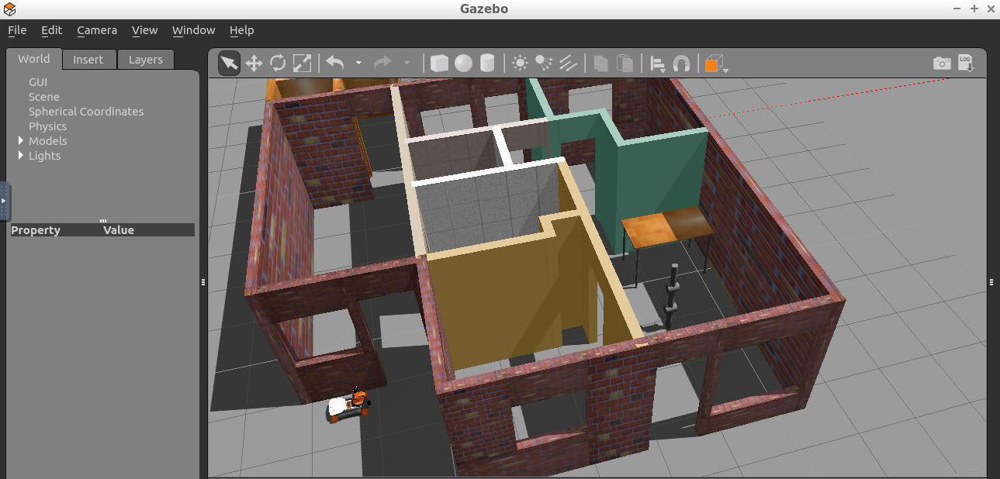
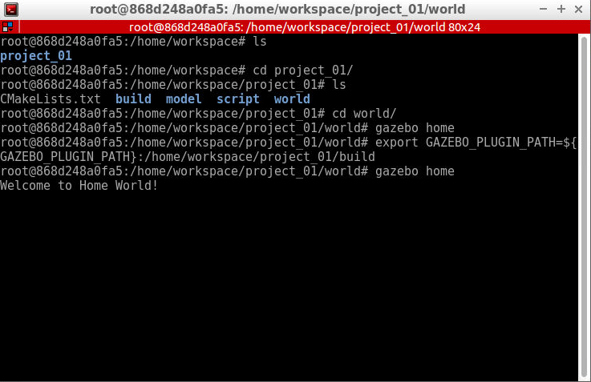

# Project 1 - Build My World

This repo contains the first project of the Robotics Software Engineer Nanodegree Program from Udacity. The program shows a world built in gazebo simulator with some elements on it, like robots and furniture.

Also, a welcome message is displayed to the terminal.

## Dependencies for Running
* cmake >= 3.11
  * Linux: [click here for installation instructions](https://cmake.org/install/)
* make >= 4.1 (Linux, Mac), 3.81 (Windows)
  * Linux: make is installed by default on most Linux distros
* gcc/g++ >= 5.4
  * Linux: gcc / g++ is installed by default on most Linux distros
* gazebo simulator >= 11.0.0
  * Linux: [gazebo download](http://gazebosim.org/download)

## Basic Build Instructions

1. Clone this repo.
2. Make a build directory in the top level directory: `mkdir build && cd build`
3. Compile: `cmake .. && make`
4. In terminal, execute: `export GAZEBO_PLUGIN_PATH=${GAZEBO_PLUGIN_PATH}:<pathToRepo>/ND-BuildMyWorld/build`
5. Go to world folder: `cd <pathToProject>/ND-BuildMyWorld/world/`
6. Open with gazebo simulator: `gazebo home`

## Summary of Tasks

Let’s summarize the tasks in this project to create a simulation world:

* Build a single floor wall structure using the Building Editor tool in Gazebo. Apply at least one feature, one color, and optionally one texture to your structure. Make sure there's enough space between the walls for a robot to navigate.
* Model any object of your choice using the Model Editor tool in Gazebo. Your model links should be connected with joints.
* Import your structure and two instances of your model inside an empty Gazebo World.
* Import at least one model from the Gazebo online library and implement it in your existing Gazebo world.
* Write a C++ World Plugin to interact with your world. Your code should display “Welcome to ’s World!” message as soon as you launch the Gazebo world file.
